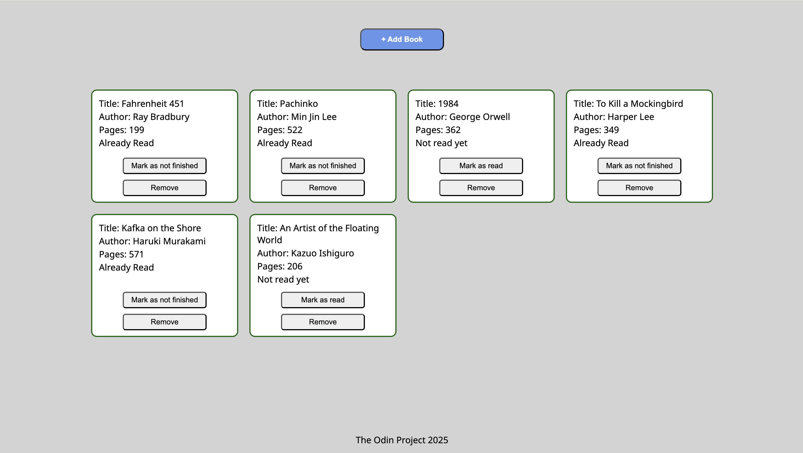

# Library

This project is a small library app. There is a modal for adding new books and the books are organized into cards showing their info: Title, Author, Number of Pages and whether or not the book has been read by the user. Each card also has buttons for toggling the read status and an option to remove the book from the library. 

You can see the project live at https://lucasbpaiva.github.io/library/

The project was a good practice for organizing the code using objects. The library itself is an array of objects where each book is an object created using a constructor. Some new things I got to experience with were prototypes where I was able to explore the concept of prototypal inheritance by setting methods on the prototype of a constructor so any objects created with it can have access to these methods.

Some other new tools I got to know were dialog modals and data-* attributes. I used a custom data-id attribute to associate the DOM elements (cards displaying the books) with the actual book objects in my library array. Dialog modals were also a new cool feature to work with and the main challenge here involved handling a form inside the dialog because it tries to send the form data to a server by default which was not was intended so I had to solve the issue by using the event.preventDefault() method.